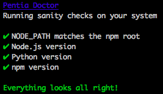

# Pentia Doctor

> Detect potential issues with users system that could prevent Pentia Build from working correctly

## Usage

Will eventually be baked into [FrontendBuilder](https://github.com/PentiaLabs/FrontendBuilder):

Until then it's in a state of development, and should be used in conjunction with [npm-link](https://docs.npmjs.com/cli/link)

So do the following to test it out at this moment:

	1. Clone this repo somewhere on your system.
	2. Cd into folder and execute npm link
	3. Run the program

Can also be run with `ptdoctor` if installed globally (or if it has been npm linked)

## License

A fork of the [Yeoman Doctor](https://github.com/yeoman/doctor)
under a
[BSD license](http://opensource.org/licenses/bsd-license.php) and copyright Google.
